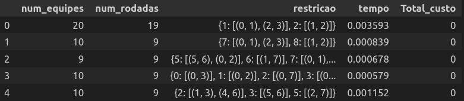

---

# Exemplo de Instâncias de Teste para o Calendário

## Este documento apresenta exemplos de instâncias de teste para o calendário gerado com restrições. Cada exemplo consiste no número de equipes e nas restrições aplicadas.

---

### Instância 1
### Número de equipes: 20
### Restrições:
   - Dia 1: Confrontos [(0, 1), (2, 3)]  
   - Dia 2: Confronto [(1, 2)]

---

### Instância 2
### Número de equipes: 10
### Restrições:
   - Dia 7: Confrontos [(0, 1), (2, 3)]  
   - Dia 8: Confronto [(1, 2)]

---

### Instância 3
### Número de equipes: 9
### Restrições:
   - Dia 5: Confrontos [(5, 6), (0, 2)]  
   - Dia 6: Confronto [(1, 7)]  
   - Dia 7: Confrontos [(0, 1), (2, 3)]  
   - Dia 8: Confronto [(1, 2)]

---

### Instância 4
### Número de equipes: 10
### Restrições:
   - Dia 0: Confronto [(0, 3)]  
   - Dia 1: Confronto [(0, 2)]  
   - Dia 2: Confronto [(0, 7)]  
   - Dia 3: Confronto [(0, 1)]  
   - Dia 4: Confronto [(0, 9)]  
   - Dia 5: Confronto [(0, 6)]  
   - Dia 6: Confronto [(0, 4)]  
   - Dia 7: Confronto [(0, 5)]  
   - Dia 8: Confronto [(0, 8)]

---

### Instância 5
### Número de equipes: 10
### Restrições:
   - Dia 2: Confrontos [(1, 3), (4, 6)]  
   - Dia 3: Confronto [(5, 6)]  
   - Dia 5: Confronto [(2, 7)]

---

### Instância 6
### Número de equipes: 10
### Restrições:
   - Dia 1: Confrontos [(0, 1), (2, 3), (4, 5), (6, 7), (8, 9)]  
   - Dia 2: Confrontos [(1, 3), (4, 6)]  
   - Dia 3: Confronto [(5, 6)]  
   - Dia 5: Confronto [(2, 7)]

---

