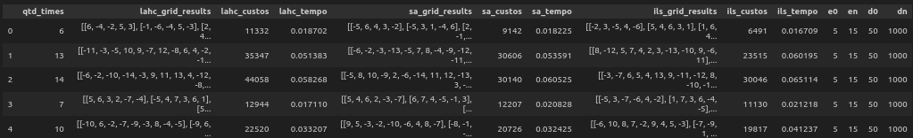

### 1. **Função de Avaliação (`calc_total_distance`)**
- **Objetivo:** Calcular a distância total que todas as equipes percorrerão em suas partidas.
- **Como Funciona:**
  - Para cada time, começa na sua cidade.
  - Para cada rodada, verifica se o time está jogando em casa ou fora.
    - Se for fora, soma a distância até o oponente.
    - Atualiza a localização do time após cada jogo.
  - No final, soma a distância de volta à cidade sede.
- **Resultado:** Retorna a distância total percorrida por todas as equipes.

### 2. **Geração de Solução Inicial (`generate_initial_solution`)**
- **Objetivo:** Criar uma programação inicial aleatória para os jogos das equipes.
- **Como Funciona:**
  - Para cada time, gera uma lista de adversários (sem incluir o próprio time).
  - Aleatoriamente, decide se o jogo será em casa ou fora (com 50% de chance).
- **Resultado:** Retorna uma programação com partidas para cada equipe.

### 3. **Função de Vizinhança (`get_neighbor`)**
- **Objetivo:** Criar uma nova solução ligeiramente diferente da solução atual.
- **Como Funciona:**
  - Faz uma cópia da solução atual.
  - Seleciona aleatoriamente um time e duas rodadas.
  - Troca os adversários dessas duas rodadas para criar um "vizinho".
- **Resultado:** Retorna uma nova programação que é um pequeno ajuste da anterior.

### 4. **Late Acceptance Hill Climbing (LAHC)**
- **Objetivo:** Melhorar uma solução através de ajustes, aceitando soluções piores em alguns casos.
- **Como Funciona:**
  - Gera uma solução inicial e calcula seu custo.
  - Mantém um histórico dos melhores custos recentes.
  - Para cada iteração, gera um "vizinho" e verifica se ele é melhor que o custo atual ou do histórico.
  - Se for melhor, a nova solução é aceita.
- **Resultado:** Retorna a melhor solução e custo após as iterações.

### 5. **Iterated Local Search (ILS)**
- **Objetivo:** Melhorar uma solução ao combinar busca local com perturbações.
- **Como Funciona:**
  - Gera uma solução inicial e calcula seu custo.
  - Em cada iteração, gera um "vizinho".
  - Com uma pequena probabilidade, gera uma nova solução inicial (perturbação).
  - Aceita a nova solução se for melhor que a atual.
- **Resultado:** Retorna a melhor solução e custo após as iterações.

### 6. **Simulated Annealing (SA)**
- **Objetivo:** Encontrar uma solução ótima explorando espaço de soluções, aceitando algumas soluções piores para escapar de ótimos locais.
- **Como Funciona:**
  - Gera uma solução inicial e calcula seu custo.
  - Utiliza um parâmetro de temperatura que diminui a cada iteração.
  - Para cada nova solução gerada, aceita-a se for melhor ou com uma probabilidade baseada na temperatura (mesmo que pior).
  - A temperatura é reduzida, permitindo que a busca se torne mais restrita com o tempo.
- **Resultado:** Retorna a melhor solução e custo após as iterações.

### 7. **Geração da Matriz de Distâncias**
- **Objetivo:** Criar uma matriz de distâncias aleatórias entre as equipes.
- **Como Funciona:**
  - Gera uma matriz simétrica com distâncias aleatórias.
  - As distâncias entre um time e ele mesmo são zero.
  - As distâncias são refletidas para garantir simetria.
- **Resultado:** Retorna uma matriz que representa as distâncias entre as equipes.

### 8. **Impressão da Programação (`print_schedule`)**
- **Objetivo:** Exibir a programação de jogos de cada equipe.
- **Como Funciona:**
  - Para cada time, imprime os adversários e se os jogos são em casa ou fora.
- **Resultado:** Mostra uma visualização clara de quem joga contra quem e onde.

