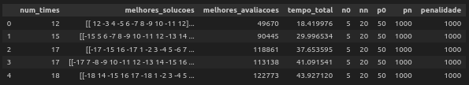

### Estrutura Geral do Algoritmo

Esse código é uma implementação de um algoritmo para resolver o problema do agendamento de partidas entre times, minimizando a distância total percorrida pelos times e respeitando algumas restrições de mando de campo. O algoritmo utiliza a técnica de **Busca Local** e **Busca Local Iterativa** (ILS) para encontrar soluções melhores.

### Funções do Algoritmo

1. **`calcular_custo_time(solucao, distancias)`**
   - **Objetivo:** Calcular a distância total percorrida por todos os times na solução.
   - **Como funciona:**
     - A função percorre cada time e cada rodada. Para cada rodada, verifica se o time jogou em casa ou fora (casa: positivo, fora: negativo) e soma as distâncias correspondentes da matriz de distâncias.

2. **`gerar_solucao_inicial(n_times)`**
   - **Objetivo:** Criar uma solução inicial para o agendamento dos jogos.
   - **Como funciona:**
     - A solução inicial é gerada de maneira que os times joguem alternadamente em casa e fora. Para cada time, ela determina um adversário com base em um padrão (circular) e alterna o mando de campo a cada rodada.

3. **`avaliar_solucao(solucao, distancias, penalidade)`**
   - **Objetivo:** Avaliar uma solução em termos de custo total e penalidades por restrições não atendidas.
   - **Como funciona:**
     - Primeiro, calcula o custo total usando `calcular_custo_time`.
     - Depois, verifica se há violações de restrições (como jogos consecutivos em casa ou fora) e aplica uma penalidade a cada violação. O custo total final é a soma do custo e das penalidades.

4. **Movimentos de Vizinhança**
   - Essas funções são responsáveis por gerar "vizinhos" da solução atual, que são soluções ligeiramente diferentes:
     - **`swap_rounds(solucao)`**: Troca as rodadas de dois jogos aleatórios.
     - **`swap_teams(solucao)`**: Troca as posições de dois times na matriz.
     - **`swap_homes(solucao)`**: Muda o mando de campo de um jogo aleatório (casa para fora e vice-versa).
     - **`replace_teams(solucao)`**: Troca a lista de jogos de dois times.

5. **`metodo_randomico_descida(solucao, distancias, penalidade, max_iter=1000)`**
   - **Objetivo:** Encontrar uma melhor solução localmente a partir de uma solução inicial.
   - **Como funciona:**
     - Inicializa a melhor solução como a solução fornecida e a avalia.
     - Em um loop, gera um vizinho aleatório da solução atual e avalia esse vizinho. Se o vizinho for melhor (menor custo), ele se torna a nova melhor solução.
     - Isso continua até o número máximo de iterações.

6. **`iterated_local_search(solucao_inicial, distancias, penalidade, max_iter_ils=100)`**
   - **Objetivo:** Implementar a Busca Local Iterativa, que combina a busca local com reavaliações.
   - **Como funciona:**
     - Começa com uma solução inicial e a avalia.
     - Em um loop, chama o `metodo_randomico_descida` para encontrar soluções locais. Se uma nova solução é melhor que a melhor solução encontrada até agora, ela é atualizada.
     - O processo se repete por um número máximo de iterações.

# Resultado testeSpolm:

